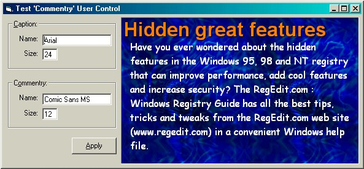



## Flicker \-free Info Control

### Description

This control was used in several commercial applications that I've written as an on-screen Help system.

I've included the prototyping code (non-api) and the flicker free API version. I hope this helps someone ..... Happy Coding!
 
### More Info
 

             |
---                |---
**Submitted On**   |2001-05-29 10:43:26
**By**             |[Slider](https://github.com/Planet-Source-Code/PSCIndex/blob/master/ByAuthor/slider.md)
**Level**          |Intermediate
**User Rating**    |4.4 (40 globes from 9 users)
**Compatibility**  |VB 6\.0
**Category**       |[Custom Controls/ Forms/  Menus](https://github.com/Planet-Source-Code/PSCIndex/blob/master/ByCategory/custom-controls-forms-menus__1-4.md)
**World**          |[Visual Basic](https://github.com/Planet-Source-Code/PSCIndex/blob/master/ByWorld/visual-basic.md)
**Archive File**   |[Flicker \-f202045292001\.zip](https://github.com/Planet-Source-Code/slider-flicker-free-info-control__1-23549/archive/master.zip)

